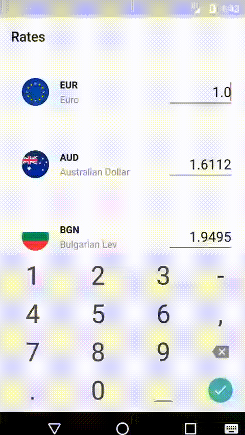

# ExchangeRatesApp

This android app requests currency exchange rates from server and displays them as a list to the user.
The user is allowed to change the amount. The rates are pulled from the server every second.
This application supports landscape mode, albeit not optimized for it.

The code is written in Kotlin using MVVM pattern and Clean Architecture.

[RxJava 2](https://github.com/ReactiveX/RxJava) is used for multi-threading and data flow.

JUnit is used for unit testing and [Mockk](https://github.com/mockk/mockk) for mocking objects.

